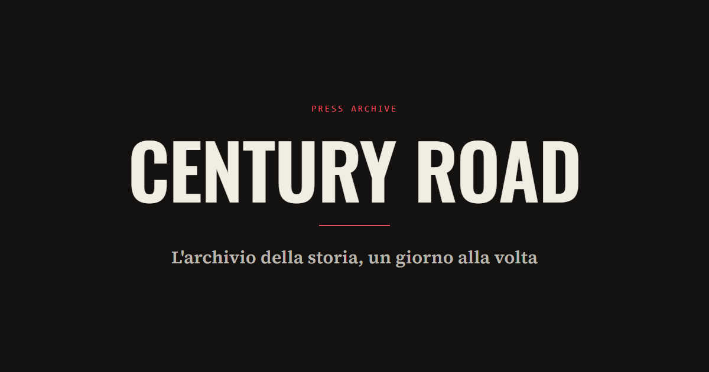

<div align="center">

# Century Road

**An interactive historical almanac — the 20th century, placed on a globe and on a calendar.**

[](https://github.com/F3rren/century-road-frontend/actions/workflows/ci.yml)
[](https://github.com/F3rren/century-road-frontend/actions/workflows/codeql.yml)
[](https://github.com/F3rren/century-road-frontend/actions/workflows/dependency-scan.yml)
[](LICENSE)
[](https://react.dev)
[](https://www.typescriptlang.org)
[](https://vite.dev)
[](https://tailwindcss.com)
[](docs/architecture.md#testing)

</div>



## What this is

Century Road places historical events both **geographically** (an interactive globe) and **temporally** ("what happened today, across the century"). It's spatial-first, not list/timeline-first: the globe is the primary navigation surface, with a per-country event-density heatmap layered on top of the calendar framing. Every event comes live from Wikipedia's "On this day" feed, through a small Spring Boot backend — no mock data.

See [docs/PRD.md](docs/PRD.md) for the full product requirements, [PRODUCT.md](PRODUCT.md) for user personas and per-route detail, and [DESIGN.md](DESIGN.md) for the visual language ("The Wire-Service Newsroom Archive").

## Features

- **Interactive globe/map** (MapLibre GL), with a flat-projection toggle
- **Country selection** by map click or an accessible `<select>` picker — always both, never map-only
- **"Accadde oggi"** — today's events highlighted, with a heatmap of event density per country
- **Archivio** — every entry across all centuries for a chosen day, filterable by year range, entry type, and language, with text search
- **Dashboard** — real statistics from the live dataset (never filler numbers), plus anonymous all-time view-popularity by day and country
- **4-language UI** (Italian default, English, German, French) via i18next
- **Light/dark theme**, persisted, no load flash
- **Full keyboard operability** and a WCAG AA accessibility floor — see [DESIGN.md's Accessibility section](DESIGN.md#accessibility)

## Tech stack

React 18.3.1 · Vite ^8.3.0 · TypeScript ^5.5.3 · Tailwind CSS ^3.4.10 · react-router-dom ^7 · i18next/react-i18next · maplibre-gl ^6.10.0 · lucide-react

Full rationale and folder structure: [docs/architecture.md](docs/architecture.md).

## Getting started

**Prerequisites**: Node 20+, and the [backend](https://github.com/F3rren/century-road-backend) running locally (or `VITE_API_BASE_URL` pointed at a reachable gateway).

```bash
npm install
npm run dev
```

The dev server proxies `/api/*` to `BACKEND_URL` (default `http://localhost:8080`, the backend gateway's default port). See [.env.example](.env.example) for both environment variables and when each applies.

## Scripts

| Command | What it does |
|---|---|
| `npm run dev` | Vite dev server at `:5173` |
| `npm run build` | `tsc && vite build` — this is also the typecheck |
| `npm run lint` | `eslint --max-warnings 0` |
| `npm run test` | Unit/component tests (Vitest + React Testing Library) |
| `npm run test:coverage` | Same, with a coverage report — nothing gates on it yet |
| `npm run preview` | Serve the production build locally |

Unit and component tests exist; there's no E2E suite yet. CI runs lint, test, and build (typecheck) on every push and PR — see [docs/architecture.md#testing](docs/architecture.md#testing) for what's covered today and two real, minor quirks the first test pass turned up.

## Deployment

Three targets, chosen per environment — Railway (primary, production at `century-road-frontend-production.up.railway.app`), Docker Compose (local full-stack dev alongside the backend), and GitHub Pages (static-only fallback). Full detail, including every environment variable and the two build-time safety guards (mixed-content and secret-leak prevention): [docs/architecture.md#deployment-and-environments](docs/architecture.md#deployment-and-environments).

## Related repository

The backend — 3 Spring Boot services behind a gateway — lives at [F3rren/century-road-backend](https://github.com/F3rren/century-road-backend).

## Documentation

| Doc | Covers |
|---|---|
| [PRODUCT.md](PRODUCT.md) | Personas, positioning, per-route capabilities and constraints |
| [docs/PRD.md](docs/PRD.md) | Full requirements: feature priority, acceptance criteria, NFRs, open questions |
| [DESIGN.md](DESIGN.md) | Design system — tokens, components, accessibility |
| [docs/architecture.md](docs/architecture.md) | Tech stack, API design, folder structure, deployment |
| [AGENTS.md](AGENTS.md) | Operational guidance for AI coding agents |

## License

[MIT](LICENSE) © 2026 Samuele Alessandro Di Silvestri
